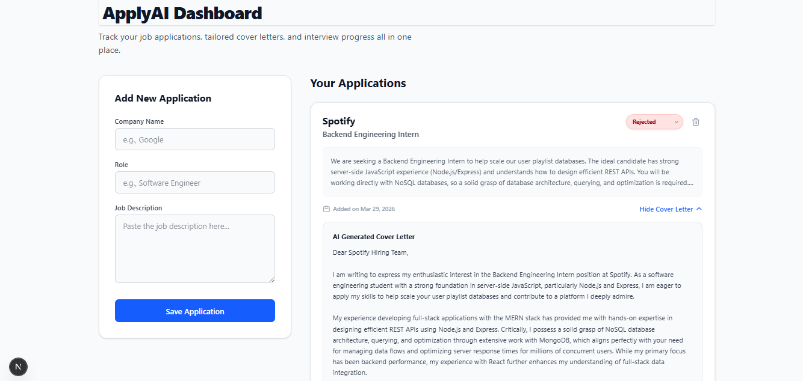

# ApplyAI 🚀 
**An AI-Powered Job Application Tracker & Cover Letter Generator**



## 📌 Overview
ApplyAI is a full-stack Next.js application designed to streamline the internship and job hunting process. It replaces messy tracking spreadsheets with a sleek dashboard and utilizes generative AI to eliminate the most tedious part of the application process: writing tailored cover letters.

By simply pasting a job description, the app securely calls the Gemini AI model to instantly generate a professional, context-aware cover letter, saving it alongside the application status in a MongoDB database.

## ✨ Key Features & Technical Highlights

* **Secure AI Integration:** Utilizes **Next.js Server Actions** to securely process the Google Gemini API call on the backend, ensuring private API keys are never exposed to the client browser.
* **Server-Side Rendering (SSR):** The main dashboard leverages React Server Components to fetch data directly from MongoDB before the page loads, eliminating client-side loading spinners and optimizing performance.
* **Full CRUD Functionality:** Users can seamlessly add new applications, update their interview status, and delete rejected applications, demonstrating a complete database lifecycle.
* **Type Safety:** Built entirely with **TypeScript**, utilizing strict interfaces and Mongoose schemas to ensure data integrity between the database and the frontend UI.
* **Modern UI/UX:** Styled completely with **Tailwind CSS**, featuring responsive CSS grid layouts, interactive dropdowns, and custom animated modal dialogs.

## 🛠️ Tech Stack
* **Framework:** Next.js (App Router)
* **Language:** TypeScript
* **Database:** MongoDB & Mongoose
* **Styling:** Tailwind CSS
* **AI Engine:** Google Gemini (gemini-2.5-flash)
* **Deployment:** Vercel

## 🚀 Getting Started Locally

1. **Clone the repository:**
   ```bash
   git clone [https://github.com/YOUR_USERNAME/apply-ai.git](https://github.com/YOUR_USERNAME/apply-ai.git)
   cd apply-ai